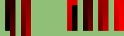

# Be Smarter. Be seetd

seetd sits you smarter. 

You like to sit. seetd does too.

Need to figure out your Thanksgiving seeting arrangement? seetd.

Determining your office seeting plan? seetd.

Want an uber for seets? Not seetd.

Want that office window seet and want to run the seeting assignment for your company? seetd.

Oh what's up with this office? Needs more <strike>cowbell</strike>seetd.

Just use seetd. Be Smarter. Be seetd.

Disrupting the sitting economy. Be seetd.

Machine learning. Synergy. Your butt. Seetd.

## Usage

Code accompanying the [blog post](http://multithreaded.stitchfix.com/blog/2017/06/29/please-remain-seetd/).

### Quick start
run `$python solve.py` to run the example.

### Long start

#### Data
`seetd_example.xlsx` contains the seating layout (i.e. physical locations of the seats) and the names and team membership
of the people.

The seating layout is defined in the tab `seat_map`.  Seats to be included should have a unique number while aisles and/or
empty seats are left blank.  1 cell counts as 1 unit of distance.  To increase distance, simply add more empty cells between
seats.

The name/team membership of the people is included in the `names` tab.  There are three self-explanatory columns:

`names`: A unique name for each person.

`Teams`: The team that the particular person belongs to.  This can be a number or string.

`current seat`: The current seat that this person is in.  If no assignment exists, just assign people randomly.  These seat
numbers should map to the numbers in `seat_map`.

#### Solving

`$python solve.py` will run the optimization.  Other accepted options are:

`--save_name SAVENAME` provides the name for the output file.

`--file_name FILENAME` is the name of the data file.

`--auto_calc_weights True` A bool specifying if the relative weights for the terms in the cost function should be calculated from their contrubutions to random arrangements.  If `False` the provided weights will be used instad.

`--cost_weights a b c` Where `a`,`b`,`c` are floats specifying the relative weights for each term in the cost function.  These will not be used if `--auto_calc_weights True`.

`--iterations N` An integer specifying the number of iterations to run for.

`--fully_connected True` A bool specifying if each seat is a neighbour of every other seat.  If set to `False` then seats within the immediate vicinity are considered neighbours.  This neghbourhood is used in propsing changes for the local optimization component.

`--team_weights a b c d` Where `a`,`b`,`c`,`d` are floats specifying the weights for sub-teams in the same-team term.  The matching is done by sorting the team names.  -ve values will cause agglomeration while +ve values will repel.

### Examples
`$python solve.py --auto_calc_weights True --iterations 230 --fully_connected False`

This will solve the default (given by `seetd_example.xlsx`) using 230 iterations and an auto-calculation of the relative weightings of each term in the cost function.  Only immediate neighbours are considered for the local optimzation component.

`$python solve.py --auto_calc_weights True --iterations 230 --team_weights 1 1 1 -1`

The same as above but now the last team has an attractive weighting (-1).

